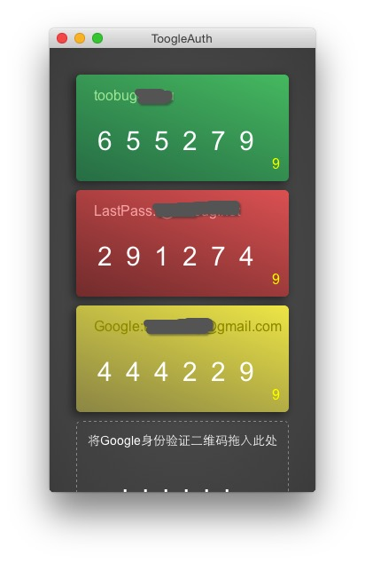

# ToogleAuth

基于Atom-Shell实现的Google Authenticator客户端。

## 什么是Google Authenticator？

Google Authenticator是Google实现的一套用于增强账户安全的两步验证方案。可用于保护Google账户安全，在[Google账户的两步验证](https://accounts.google.com/b/0/SmsAuthSettings)中可以找到相关设置。

除了用于Google自家产品以外，这套方案还广泛应用于各大互联网服务，如Facebook、dropbox、LastPass均可以使用Google Authenticator实现帐户两步验证。WordPress也有插件可以实现两步验证。

## 本项目是什么？

这个项目就是Google Authenticator的一种实现，可以不依赖手机APP实验对账户的两步验证。

## 安全不？

没办法回答“是”，安全永远是相对的，我只能说，本项目不会故意泄露你的机密，也不会上报任何数据。

## 截图

